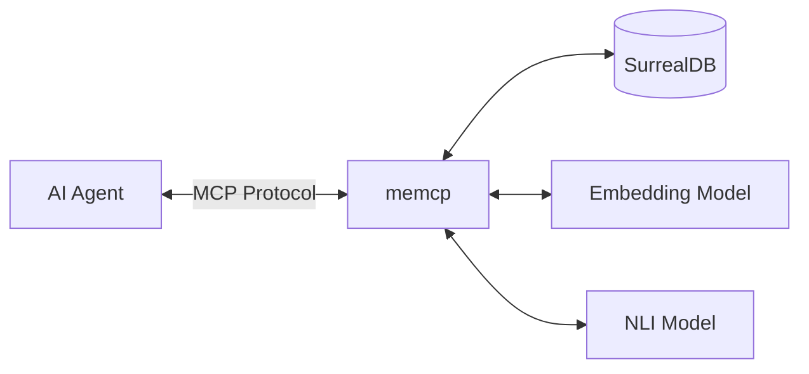
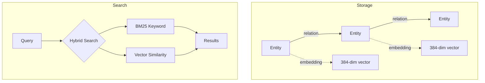

# memcp

MCP server that gives AI agents persistent memory using SurrealDB as a knowledge graph backend.

## Architecture



## How It Works



Entities store content with vector embeddings for semantic search. Relations create a traversable graph. Search combines BM25 keyword matching with cosine similarity for hybrid retrieval.

## Tools

| Tool | Description |
|------|-------------|
| `search` | Hybrid semantic + keyword search with configurable weighting |
| `get_entity` | Retrieve entity by ID |
| `list_labels` | List all categories/tags in memory |
| `traverse` | Explore graph connections from a starting entity |
| `find_path` | Find shortest path between two entities |
| `remember` | Store entities and relations with optional contradiction check |
| `forget` | Delete entity and its relations |
| `reflect` | Maintenance: decay old memories, find duplicates |
| `check_contradictions` | Detect conflicting information using NLI |

## Installation

```bash
# Install with uv/pip
uv pip install memcp

# Or run directly with uvx
uvx memcp
```

## Configuration

Environment variables:

| Variable | Default | Description |
|----------|---------|-------------|
| `SURREALDB_URL` | `ws://localhost:8000/rpc` | SurrealDB connection URL |
| `SURREALDB_NAMESPACE` | `knowledge` | Database namespace |
| `SURREALDB_DATABASE` | `graph` | Database name |
| `SURREALDB_USER` | - | Username (optional) |
| `SURREALDB_PASS` | - | Password (optional) |

## Claude Desktop Config

```json
{
  "mcpServers": {
    "memory": {
      "command": "uvx",
      "args": ["memcp"],
      "env": {
        "SURREALDB_URL": "ws://localhost:8000/rpc"
      }
    }
  }
}
```

## Models Used

- **Embeddings**: `all-MiniLM-L6-v2` - 384-dim vectors for semantic similarity
- **NLI**: `cross-encoder/nli-deberta-v3-base` - contradiction detection between statements
