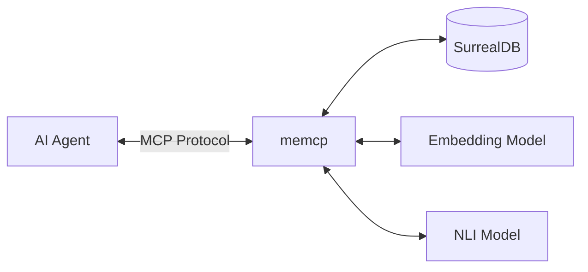
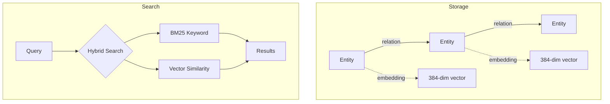

# memcp

MCP server that gives AI agents persistent memory using SurrealDB as a knowledge graph backend.

## Architecture



## How It Works



Entities store content with vector embeddings for semantic search. Relations create a traversable graph. Search combines BM25 keyword matching with cosine similarity for hybrid retrieval.

## Tools

### Search & Retrieval
| Tool | Description |
|------|-------------|
| `search` | Hybrid semantic + keyword search with context filtering |
| `get_entity` | Retrieve entity by ID |
| `list_labels` | List all categories/tags in memory |
| `list_contexts` | List all project namespaces |
| `get_context_stats` | Get entity/episode counts for a context |
| `list_entity_types` | List all available entity types with descriptions |
| `search_by_type` | Search entities by type (e.g., "preference", "decision") |

### Episodic Memory
| Tool | Description |
|------|-------------|
| `add_episode` | Store a complete conversation session |
| `search_episodes` | Search episodes by content and time range |
| `get_episode` | Retrieve episode with linked entities |
| `delete_episode` | Delete an episode |

### Graph Traversal
| Tool | Description |
|------|-------------|
| `traverse` | Explore graph connections from a starting entity |
| `find_path` | Find shortest path between two entities |

### Persistence
| Tool | Description |
|------|-------------|
| `remember` | Store entities and relations with context/importance |
| `forget` | Delete entity and its relations |

### Procedural Memory
| Tool | Description |
|------|-------------|
| `add_procedure` | Store a step-by-step workflow or process |
| `get_procedure` | Retrieve a procedure by ID |
| `search_procedures` | Search procedures by name, description, or steps |
| `list_procedures` | List all stored procedures |
| `delete_procedure` | Delete a procedure |

### Maintenance
| Tool | Description |
|------|-------------|
| `reflect` | Decay old memories, find duplicates, recalculate importance |
| `check_contradictions` | Detect conflicting information using NLI |

## Installation

```bash
# Install with uv/pip
uv pip install memcp

# Or run directly with uvx
uvx memcp
```

## Configuration

Environment variables:

| Variable | Default | Description |
|----------|---------|-------------|
| `SURREALDB_URL` | `ws://localhost:8000/rpc` | SurrealDB connection URL |
| `SURREALDB_NAMESPACE` | `knowledge` | Database namespace |
| `SURREALDB_DATABASE` | `graph` | Database name |
| `SURREALDB_USER` | `root` | Username |
| `SURREALDB_PASS` | `root` | Password |
| `MEMCP_DEFAULT_CONTEXT` | - | Default project context for all operations |
| `MEMCP_CONTEXT_FROM_CWD` | `false` | Auto-detect context from working directory |

## Claude Desktop Config

```json
{
  "mcpServers": {
    "memory": {
      "command": "uvx",
      "args": ["memcp"],
      "env": {
        "SURREALDB_URL": "ws://localhost:8000/rpc"
      }
    }
  }
}
```

## Models Used

- **Embeddings**: `all-MiniLM-L6-v2` - 384-dim vectors for semantic similarity
- **NLI**: `cross-encoder/nli-deberta-v3-base` - contradiction detection between statements

## Example Prompts

### Storing Knowledge
```
"Remember that I prefer TypeScript over JavaScript for new projects"
→ remember(entities=[{id: "pref-typescript", content: "User prefers TypeScript over JavaScript", labels: ["preference"]}])

"Store this conversation for later reference"
→ add_episode(content: "...", context: "project-x")
```

### Searching Memory
```
"What do you know about my coding preferences?"
→ search(query: "coding preferences", labels: ["preference"])

"What did we discuss last week about the API design?"
→ search_episodes(query: "API design", time_start: "2024-01-01")
```

### Project Namespacing
```
"Remember this for the memcp project"
→ remember(entities=[...], context: "memcp")

"What do I know about project X?"
→ search(query: "*", context: "project-x")
→ get_context_stats(context: "project-x")
```

### Knowledge Graph
```
"How are authentication and user-service connected?"
→ find_path(from_id: "authentication", to_id: "user-service")

"What's related to the payment system?"
→ traverse(start: "payment-system", depth: 2)
```

### Maintenance
```
"Clean up my memory and find duplicates"
→ reflect(find_similar: true, apply_decay: true)

"Check for contradictions in my preferences"
→ check_contradictions(labels: ["preference"])
```

### Importance Scoring
```
"This is very important to remember"
→ remember(entities=[{id: "...", content: "...", importance: 0.9}])

"Recalculate importance scores for all memories"
→ reflect(recalculate_importance: true)
```

### Entity Types
```
"What types of knowledge do you store?"
→ list_entity_types()

"Show all my preferences"
→ search_by_type(entity_type: "preference")

"List all decisions I've made for this project"
→ search_by_type(entity_type: "decision", context: "myproject")

"Remember this as a requirement"
→ remember(entities=[{id: "req-auth", type: "requirement", content: "API must use OAuth2"}])
```

### Procedural Memory
```
"How do I deploy the app?"
→ search_procedures(query: "deploy")

"Remember these deployment steps"
→ add_procedure(
    name: "Deploy to production",
    description: "Steps to deploy the application",
    steps: [
      {content: "Run tests with pytest"},
      {content: "Build Docker image"},
      {content: "Push to registry"},
      {content: "Update Kubernetes deployment"}
    ],
    labels: ["deployment", "devops"]
  )

"What procedures do we have for this project?"
→ list_procedures(context: "myproject")

"Show me the testing workflow"
→ get_procedure(procedure_id: "testing-workflow")
```
