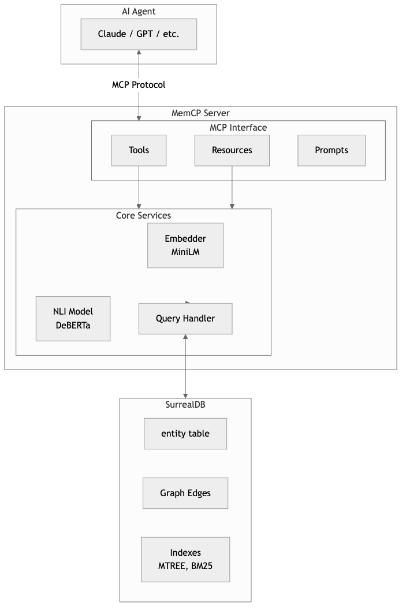
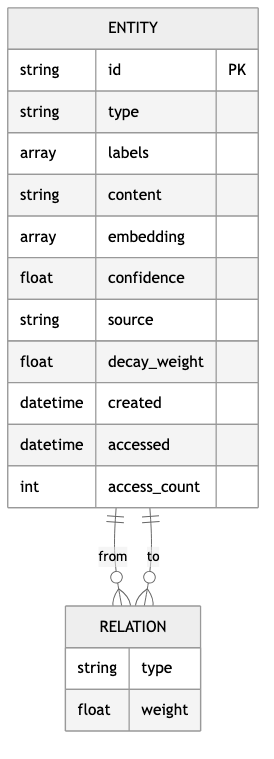
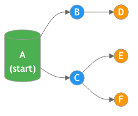
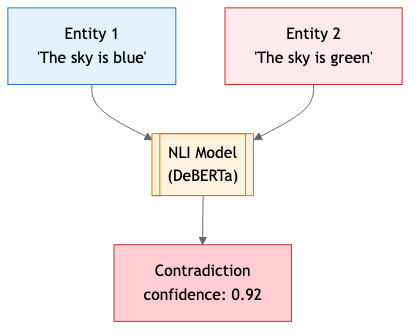
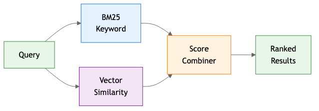

# MemCP User Guide

A persistent memory layer for AI agents using SurrealDB as a knowledge graph backend.

## Overview

MemCP is an MCP (Model Context Protocol) server that enables AI agents to store, retrieve, and manage knowledge across sessions. It provides:

- **Semantic search** with hybrid BM25 + vector similarity
- **Knowledge graph** with entity relationships
- **Contradiction detection** using NLI models
- **Memory maintenance** with decay and deduplication
- **LLM-powered features** like auto-tagging and summarization

## Architecture



## Data Model



### Entity

The core unit of memory storage:

| Field | Type | Description |
|-------|------|-------------|
| `id` | string | Unique identifier |
| `type` | string | Category (default: "concept") |
| `labels` | string[] | Tags for organization |
| `content` | string | The actual memory content |
| `embedding` | float[384] | Semantic vector representation |
| `confidence` | float | Trust score (0-1) |
| `source` | string | Origin of the memory |
| `decay_weight` | float | Temporal relevance (decreases over time) |
| `created` | datetime | When stored |
| `accessed` | datetime | Last retrieval time |
| `access_count` | int | Number of retrievals |

### Relations

Entities connect via typed edges:

```
entity:user_prefs ──[prefers]──▶ entity:dark_mode
entity:project_x  ──[uses]────▶ entity:python
entity:bug_123    ──[fixed_by]─▶ entity:commit_abc
```

## Tools Reference

### search

Search memories using hybrid semantic + keyword matching.

**Parameters:**

| Name | Type | Default | Description |
|------|------|---------|-------------|
| `query` | string | required | Search query |
| `labels` | string[] | null | Filter by labels |
| `limit` | int | 10 | Max results (1-100) |
| `semantic_weight` | float | 0.5 | Balance semantic vs keyword (0-1) |
| `summarize` | bool | false | Generate LLM summary of results |

**Returns:** `SearchResult` with entities, count, and optional summary.

**Example:**
```json
{
  "query": "user preferences for UI",
  "labels": ["settings", "preferences"],
  "limit": 5,
  "summarize": true
}
```

---

### get_entity

Retrieve a specific memory by ID.

**Parameters:**

| Name | Type | Description |
|------|------|-------------|
| `entity_id` | string | The entity ID to retrieve |

**Returns:** `EntityResult` or null if not found.

---

### list_labels

Get all unique labels/tags in the memory store.

**Parameters:** None

**Returns:** `string[]` of all labels.

---

### traverse

Explore connections from a starting entity.

**Parameters:**

| Name | Type | Default | Description |
|------|------|---------|-------------|
| `start` | string | required | Starting entity ID |
| `depth` | int | 2 | How many hops to traverse (1-10) |
| `relation_types` | string[] | null | Filter by relation types |

**Returns:** JSON string of connected entities.

**Graph Traversal:**



Green = start (depth 0), Blue = depth 1, Orange = depth 2

---

### find_path

Find the shortest path between two entities.

**Parameters:**

| Name | Type | Default | Description |
|------|------|---------|-------------|
| `from_id` | string | required | Starting entity ID |
| `to_id` | string | required | Target entity ID |
| `max_depth` | int | 5 | Maximum path length (1-20) |

**Returns:** JSON string of path entities.

---

### remember

Store new memories with optional contradiction detection and auto-tagging.

**Parameters:**

| Name | Type | Default | Description |
|------|------|---------|-------------|
| `entities` | dict[] | null | Entities to store |
| `relations` | dict[] | null | Relations to create |
| `detect_contradictions` | bool | false | Check for conflicts |
| `auto_tag` | bool | false | Generate labels via LLM |

**Entity Format:**
```json
{
  "id": "user_pref_theme",
  "content": "User prefers dark mode for all applications",
  "type": "preference",
  "labels": ["settings", "ui"],
  "confidence": 0.9,
  "source": "user_statement"
}
```

**Relation Format:**
```json
{
  "from": "user_pref_theme",
  "to": "dark_mode",
  "type": "prefers",
  "weight": 1.0
}
```

**Returns:** `RememberResult` with counts and any detected contradictions.

---

### forget

Delete a memory and its relations.

**Parameters:**

| Name | Type | Description |
|------|------|-------------|
| `entity_id` | string | Entity to delete |

**Returns:** Confirmation string.

---

### reflect

Maintenance tool for memory hygiene.

**Parameters:**

| Name | Type | Default | Description |
|------|------|---------|-------------|
| `apply_decay` | bool | true | Reduce weight of old memories |
| `decay_days` | int | 30 | Age threshold for decay |
| `find_similar` | bool | true | Find duplicate candidates |
| `similarity_threshold` | float | 0.85 | Duplicate detection threshold |
| `auto_merge` | bool | false | Automatically merge duplicates |

**Decay Formula:**
```
if accessed < (now - decay_days) and decay_weight > 0.1:
    decay_weight = decay_weight * 0.9
```

**Returns:** `ReflectResult` with decay count, similar pairs, and merge count.

---

### check_contradictions_tool

Detect conflicting information using NLI.

**Parameters:**

| Name | Type | Default | Description |
|------|------|---------|-------------|
| `entity_id` | string | null | Check specific entity |
| `labels` | string[] | null | Check entities with labels |

**How it works:**



**Returns:** `list[Contradiction]` with entity pairs and confidence scores.

## Resources

### memory://stats

Read-only statistics about the memory store.

**Returns:**
```json
{
  "total_entities": 142,
  "total_relations": 89,
  "labels": ["project", "preference", "fact"],
  "label_counts": {
    "project": 45,
    "preference": 23,
    "fact": 74
  }
}
```

### memory://labels

List of all unique labels.

**Returns:** `string[]`

## Prompts

Reusable prompt templates for common memory operations.

### summarize_memories

Generate a summary of knowledge about a topic.

**Arguments:** `topic: string`

### recall_context

Recall relevant context for a task.

**Arguments:** `task: string`

### find_connections

Explore how two concepts relate.

**Arguments:** `concept1: string`, `concept2: string`

### memory_health_check

Audit memory for duplicates and contradictions.

**Arguments:** None

## Configuration

Environment variables:

| Variable | Default | Description |
|----------|---------|-------------|
| `SURREALDB_URL` | `ws://localhost:8000/rpc` | Database connection |
| `SURREALDB_NAMESPACE` | `knowledge` | SurrealDB namespace |
| `SURREALDB_DATABASE` | `graph` | SurrealDB database |
| `SURREALDB_USER` | null | Auth username |
| `SURREALDB_PASS` | null | Auth password |
| `MEMCP_QUERY_TIMEOUT` | `30` | Query timeout (seconds) |

## Search Algorithm

MemCP uses hybrid search combining:



1. **BM25** - Traditional keyword matching with TF-IDF weighting
2. **Vector similarity** - Cosine similarity on semantic embeddings

```
final_score = (vector_score * semantic_weight) +
              (bm25_score * (1 - semantic_weight))
```

**When to adjust `semantic_weight`:**

| Value | Best for |
|-------|----------|
| 0.0 | Exact keyword matches only |
| 0.3 | Keyword-focused with some semantic |
| 0.5 | Balanced (default) |
| 0.7 | Semantic-focused with keyword boost |
| 1.0 | Pure semantic similarity |

## Best Practices

### Storing Memories

1. **Use descriptive IDs** - `user_pref_theme` not `pref1`
2. **Add labels** - Enables efficient filtering
3. **Set confidence** - Lower for uncertain information
4. **Include source** - Track where memories came from

### Organizing Knowledge

```
Entities:
├── preferences/     (user settings, choices)
├── facts/          (verified information)
├── context/        (project details, environment)
├── decisions/      (choices made, rationale)
└── learnings/      (lessons, insights)
```

### Maintenance

Run `reflect()` periodically to:
- Decay stale memories
- Identify duplicates
- Keep the knowledge graph clean

### Contradiction Handling

When contradictions are detected:
1. Check confidence scores
2. Verify sources
3. Keep the more recent/reliable one
4. Use `forget()` to remove outdated info
